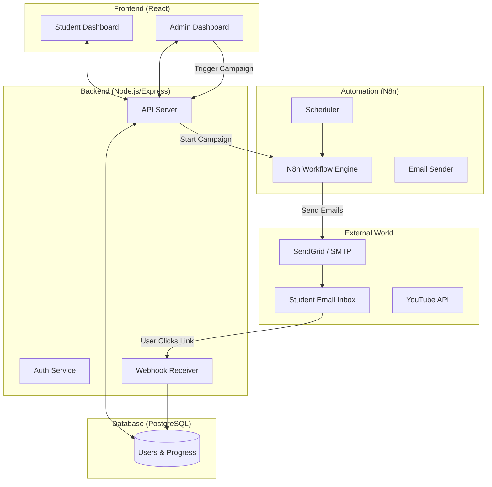
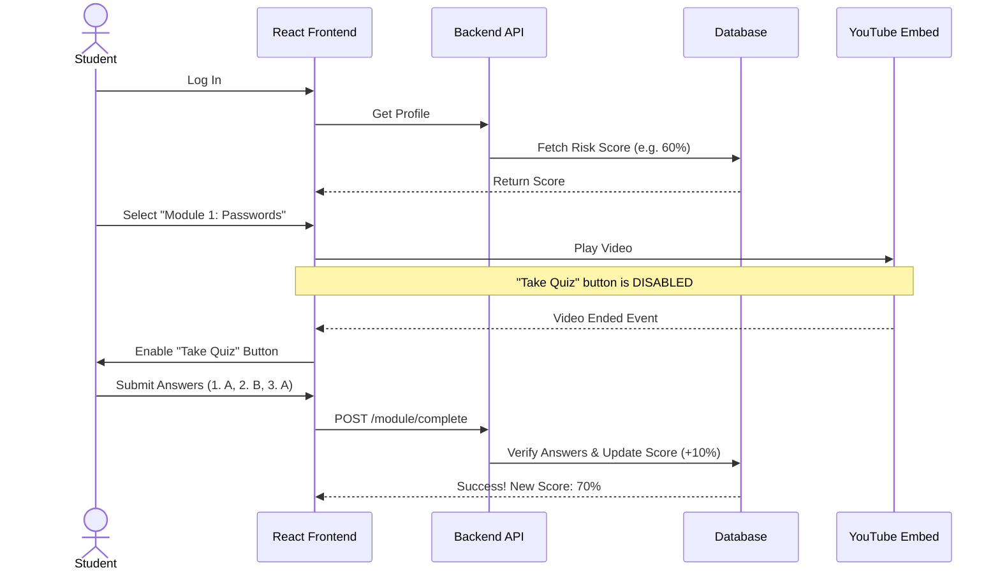
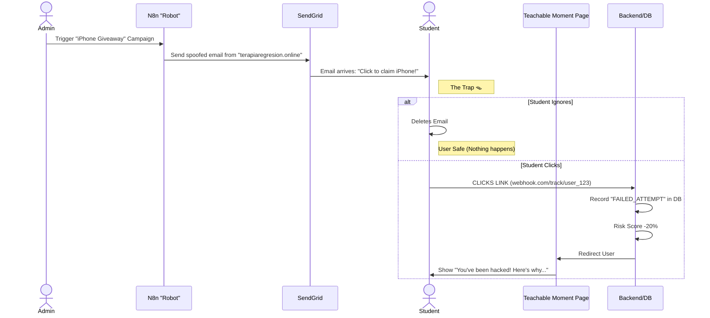

# System Flow & Visual Architecture

## 1. High-Level Architecture
How the pieces talk to each other.

---

## 2. Student Learning Journey (The "Good" Path)
How a student raises their security score.

---

## 3. The Phishing Simulation Loop (The "Trap")
How N8n tricks the student and we catch them.

